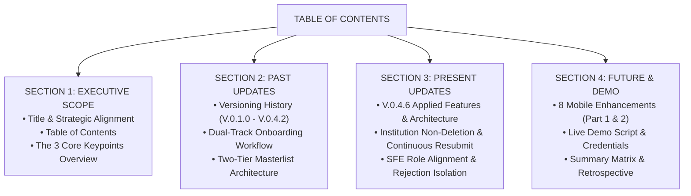
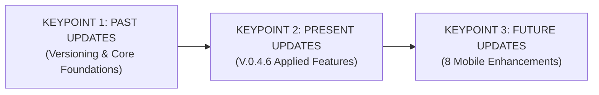
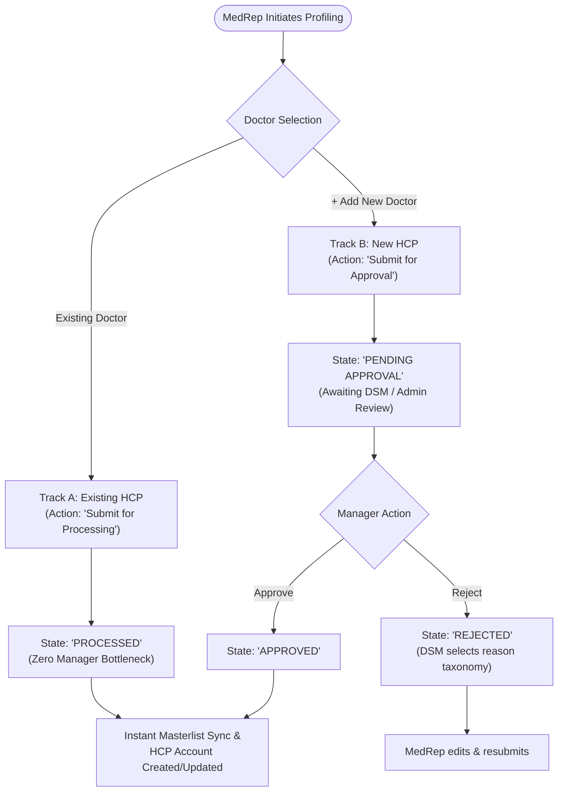

# 📊 Scrum Presentation: HCP Profiling App Lifecycle & Roadmap
**Framework:** 3 Core Keypoints (Past Versioning History, Present V.0.4.6 Features, and Future 8-Point Enhancements)  
**Active Release:** `V.0.4.6` (Build 17)  
**Target Backend:** ERPNext v15 Multi-Tenant Cloud  
**Companion File:** [`docs/HCP_Profiling_App_Scrum_Presentation.pptx`](file:///c:/Users/User%201/Downloads/HCP_Test/HCP_Test_Repo/docs/HCP_Profiling_App_Scrum_Presentation.pptx)  
**Companion PDF:** [`docs/HCP_Profiling_App_Scrum_Presentation.pdf`](file:///c:/Users/User%201/Downloads/HCP_Test/HCP_Test_Repo/docs/HCP_Profiling_App_Scrum_Presentation.pdf)  
**Release Binary:** [`releases/V.0.4.6/HCP_Profiling_V.0.4.6.apk`](file:///c:/Users/User%201/Downloads/HCP_Test/HCP_Test_Repo/releases/V.0.4.6/HCP_Profiling_V.0.4.6.apk)

---

## 📑 Slide Deck & Agenda Index
* [Slide 1: Executive Title & Scope](#slide-1-executive-title--scope)
* [Slide 2: Table of Contents (Structural Agenda)](#slide-2-table-of-contents-structural-agenda)
* [Slide 3: Executive Agenda: The 3 Core Keypoints](#slide-3-executive-agenda-the-3-core-keypoints)
* [Slide 4: KEYPOINT 1 — PAST UPDATES: Versioning Evolution & Documentation (V.0.1.0 - V.0.4.2)](#slide-4-keypoint-1--past-updates-versioning-evolution--documentation-v010---v042)
* [Slide 5: KEYPOINT 1 — PAST UPDATES: Dual-Track Profiling Workflow & Wizard Engine](#slide-5-keypoint-1--past-updates-dual-track-profiling-workflow--wizard-engine)
* [Slide 6: KEYPOINT 2 — PRESENT UPDATES: Active Release V.0.4.6 (Build 17) Applied Functionality](#slide-6-keypoint-2--present-updates-active-release-v046-build-17-applied-functionality)
* [Slide 7: KEYPOINT 2 — PRESENT UPDATES: Institution Non-Deletion, Continuous Resubmission & SFE Role Alignment](#slide-7-keypoint-2--present-updates-institution-non-deletion-continuous-resubmission--sfe-role-alignment)
* [Slide 8: KEYPOINT 2 — PRESENT UPDATES: Unlocked Pending Facilities, Dynamic Approval Notes & Filter Parity](#slide-8-keypoint-2--present-updates-unlocked-pending-facilities-dynamic-approval-notes--filter-parity)
* [Slide 9: KEYPOINT 3 — FUTURE UPDATES: Mobile Enhancements 1 to 4 (Tabs & Layout)](#slide-9-keypoint-3--future-updates-mobile-enhancements-1-to-4-tabs--layout)
* [Slide 10: KEYPOINT 3 — FUTURE UPDATES: Mobile Enhancements 5 to 8 (Validation, Deduplication & Audit)](#slide-10-keypoint-3--future-updates-mobile-enhancements-5-to-8-validation-deduplication--audit)
* [Slide 11: Test Credentials Matrix & 4-Minute Live Demo Script](#slide-11-test-credentials-matrix--4-minute-live-demo-script)
* [Slide 12: Summary & Retrospective: Key Takeaways Across Past, Present, and Future](#slide-12-summary--retrospective-key-takeaways-across-past-present-and-future)

---

## Slide 1: Executive Title & Scope

### 🎯 Slide Overview
* **Title:** Healthcare Professional (HCP) Profiling App: Scrum Review & Strategic Roadmap
* **Structure:** A Comprehensive Discussion Across 3 Core Pillars: **Past, Present, and Future Updates**
* **Active Version:** `V.0.4.6` (Build 17)
* **Target Audience:** Product Owners, Scrum Masters, Engineering Team, SFE Leaders, and Commercial Stakeholders

> **Speaker Notes:**  
> *"Good morning team and stakeholders. Today we present the complete Scrum Review for the HCP Profiling App, structured around our 3 core keypoints: Past Updates (retrieving our versioning documentation and foundational architecture), Present Updates (the live applied functionality and features across V.0.4.3 through V.0.4.6), and Future Updates (the 8 essential mobile workflow enhancements for upcoming sprints)."*

---

## Slide 2: Table of Contents (Structural Agenda)

### 🗺️ Discussion Map: 4 Thematic Sections

### 📋 Detailed Structural Breakdown

| Section | Slides | Core Topic | Key Discussion Takeaway |
| :--- | :--- | :--- | :--- |
| **Section 1: Executive Scope** | Slides 1 - 3 | Executive Alignment & Strategic Framework | Introduces project objectives, 3-pillar framework, and scope boundaries across commercial teams. |
| **Section 2: Keypoint 1 (Past Updates)** | Slides 4 - 5 | Versioning History & System Foundations | Chronological retrieval of V.0.1.0 through V.0.4.2 milestones, dual-track onboarding, and two-tier masterlist design. |
| **Section 3: Keypoint 2 (Present Updates)** | Slides 6 - 8 | Live Release V.0.4.6 Applied Features | Zero-deletion policy for proposed institutions, continuous modify & resubmit, SFE role parity, rejection note isolation, and dynamic notes. |
| **Section 4: Keypoint 3 (Future Updates & Demo)** | Slides 9 - 12 | 8 Mobile Enhancements, Demo, & Retrospective | Consent placement, hidden Others tab, GPS tracking, mandatory fields, duplicate detection, test credentials, and sprint learnings. |

> **Speaker Notes:**  
> *"Our Table of Contents is organized into 4 distinct sections. Section 1 establishes our executive alignment and introduces the 3 Core Keypoints framework. In Section 2, we review Past Updates from V.0.1.0 to V.0.4.2, examining our two-tier masterlist and dual-track workflow. In Section 3, we demonstrate Present Updates in our active V.0.4.6 release, detailing how we eliminated deletion risks to allow continuous modify & resubmit, resolved SFE workflow permissions, isolated rejection notes, and unlocked pending facility profiling. Finally, in Section 4, we examine our Future Roadmap covering all 8 field enhancements, followed by our live demonstration script and sprint retrospective."*

---

## Slide 3: Executive Agenda: The 3 Core Keypoints

### 📋 Executive Agenda Breakdown
1. **Keypoint 1: Past Updates (Versioning Evolution V.0.1.0 - V.0.4.2)**
   * Chronological milestones retrieved from project release history.
   * Two-Tier Masterlist Architecture (`HCP` Universal vs `HCP Account` Program Affiliation).
   * Dual-Track Onboarding: 0-approval instant processing for existing doctors vs DSM review for new doctors.
2. **Keypoint 2: Present Updates (Active Release V.0.4.6 Build 17 Applied Features)**
   * **Zero Institution Deletion & Continuous Modify/Resubmit (`V.0.4.6`):** Completely removed "Discard" options; MedReps can continuously update and resubmit rejected facilities without data loss; SFE rejections never permanently delete submissions.
   * **SFE Workflow & Role Alignment (`V.0.4.5`):** Resolved ERPNext HTTP 417 transition lockouts by aligning `Sales Force Effectiveness`, `System Manager`, and `Sales Manager` role permissions in `Institution WF` with CSRF protection and client fallback.
   * **Rejection Remarks Isolation (`V.0.4.4`):** Red rejection notes only appear on truly rejected submissions. Approved, processed, and pending profiles remain clean.
   * **SFE Institution Proposal Capability (`V.0.4.4`):** SFE Specialists can directly propose new institutions when encountering unlisted facilities.
   * **Unlocked Pending Facility Profiling (`V.0.4.3`):** MedReps can profile doctors at proposed facilities immediately.
   * **Dynamic Approval Notes (`V.0.4.3`):** Real-time label `"this institution is not yet approved"` (amber) dynamically transitions to `"this institution is now approved"` (green) post-approval.
3. **Keypoint 3: Future Updates (The 8 Field & Mobile Enhancements)**
   * 1. Consent tab positioned last (Doctor Info $\rightarrow$ Questionnaire $\rightarrow$ Consent).
   * 2. "Others" tab hidden to streamline mobile UI.
   * 3. Always-active Geolocation for continuous on-site verification.
   * 4. Mandatory field legend in Doctor Information.
   * 5. Mandatory Specialization & Workplace marked with red asterisk (`*`).
   * 6. Missing fields pop-up notification modal.
   * 7. Real-time Duplicate Detection across PRC, doctor name, and clinic.
   * 8. "Changes" audit history positioned directly below Consent.

---

## Slide 4: KEYPOINT 1 — PAST UPDATES: Versioning Evolution & Documentation (V.0.1.0 - V.0.4.2)

### 📜 Historical Roadmap Milestones (Retrieved from `CHANGELOG.md`)

* **`V.0.1.0`: Core Architecture & ERPNext Integration**
  - Initial Flutter cross-platform architecture interfacing with ERPNext v15 REST API.
  - Decoupled universal doctor identity into the Two-Tier Masterlist (`HCP` Universal vs `HCP Account`).
  - Offline SQLite database (`DatabaseHelper`) initialization for offline clinics.
* **`V.0.2.0` - `V.0.2.6`: Institution Workflow & Scoping Hardening**
  - `V.0.2.0`: Built the Add New Institution workflow with SFE Specialist review authority.
  - `V.0.2.1` - `V.0.2.3`: Implemented District Sales Manager (DSM) territory scoping and mandatory rejection reasons.
  - `V.0.2.4` - `V.0.2.5`: Embedded official PSGC geographic hierarchy (Region, Province, City, Barangay) with bidirectional auto-resolution.
  - `V.0.2.6`: Enforced strict gating (`isApprovedForProfiling`), blocking unapproved clinics from doctor profiling.
* **`V.0.3.0` - `V.0.3.1`: Dynamic Notes & UI Alignment**
  - `V.0.3.0`: Introduced dynamic workplace approval notes (`this institution is still pending for approval` / `this institution are now approved`) on ERPNext and mobile. Smart predictive search over ~7,000 facilities with duplicate warning banner.
  - `V.0.3.1`: Renamed menu to "Institution Submission" to clarify MedRep submission vs SFE approval roles.
* **`V.0.4.0` - `V.0.4.2`: Master Directory & Filter Parity**
  - `V.0.4.0`: Built dedicated `InstitutionDirectoryScreen` matching ERPNext Desk List View alignment; unlocked full admin parity for SFE Specialists.
  - `V.0.4.1`: Removed status tabs to create a unified masterlist directory with a centered hideable filter.
  - `V.0.4.2`: Brought complete search filter engine parity (= Filter toggle, inline Clear Filters, dynamic counter) and restored 3,900+ draft facilities.

---

## Slide 5: KEYPOINT 1 — PAST UPDATES: Dual-Track Profiling Workflow & Wizard Engine

### 🔄 Dual-Track Workflow Alignment (ERPNext HCP Profile Submission WF)

### 📋 Detailed Workflow Principles
1. **Existing Doctor (`Existing HCP`)**:
   * Action: `Submit for Processing` (doc.profile_action == 'Existing HCP').
   * **Zero Manager Bottleneck:** Transitions directly to `PROCESSED` with **NO managerial approval required**.
   * Eliminates administrative delays for verified doctors.
2. **New Doctor (`+ Add New Doctor`)**:
   * Action: `Submit for Approval` (doc.profile_action == 'New HCP').
   * Enters `PENDING APPROVAL` state awaiting District Manager review.
   * DSM Approval: Clicks `Approve` $\rightarrow$ State: `APPROVED` $\rightarrow$ Committed to Universal HCP Masterlist & local HCP Account.
   * DSM Rejection: Clicks `Reject` with reason $\rightarrow$ State: `REJECTED` $\rightarrow$ MedRep receives alert, edits, and resubmits.

---

## Slide 6: KEYPOINT 2 — PRESENT UPDATES: Active Release V.0.4.6 (Build 17) Applied Functionality

### 📊 Current Sprint Health & Deliverables
* **Compilation Status:** **0 Errors** across all modules (`flutter analyze` and `flutter test` verified).
* **Active Version:** **`V.0.4.6` (Build 17)**.
* **Release Artifact:** [`releases/V.0.4.6/HCP_Profiling_V.0.4.6.apk`](file:///c:/Users/User%201/Downloads/HCP_Test/HCP_Test_Repo/releases/V.0.4.6/HCP_Profiling_V.0.4.6.apk) *(56.6 MB, SHA-256: `BC9B39EF152E70107B80FD9EBDE9618C63858BD4A96E1BECC373044A6E976F5A`)*.
* **Directory Scale:** **3,990+ facilities** loaded across all 17 regions with sub-second response times.

### 🌟 V.0.4.3 through V.0.4.6 Feature Matrix
1. **Institution Non-Deletion & Continuous Modify/Resubmit (`V.0.4.6`)**: Removed all deletion and discard options across MedRep and SFE screens. MedReps can modify and resubmit rejected facilities continuously without data loss.
2. **ERPNext Workflow & Role Alignment (`V.0.4.5`)**: Resolved ERPNext HTTP 417 transition failures by assigning `Sales Force Effectiveness` role and updating `Institution WF` permissions for `System Manager` & `Sales Manager`.
3. **Rejection Remarks Isolation (`V.0.4.4`)**: Strict conditional gating ensures red rejection banners only appear on submissions that actually failed review.
4. **SFE Institution Proposal Capability (`V.0.4.4`)**: SFE Specialists can directly propose new facilities into the masterlist from their dashboard.
5. **Unlocked Pending Facility Profiling (`V.0.4.3`)**: MedReps can immediately profile doctors at newly proposed clinics without waiting.
6. **Dynamic Approval Notes (`V.0.4.3`)**: Amber `"this institution is not yet approved"` automatically flips to emerald green `"this institution is now approved"` upon SFE approval.
7. **Search Filter Engine Parity**: Unified collapsible filter bar, instant reset, dynamic counter (`Showing X of Y`), and clipboard copy chips.

---

## Slide 7: KEYPOINT 2 — PRESENT UPDATES: Institution Non-Deletion, Continuous Resubmission & SFE Role Alignment

### 🛡️ Zero Deletion & Continuous Resubmission Architecture (`V.0.4.6`)
* **MedRep Non-Deletion Guarantee**:
  - Removed the `Discard` / `Discard & Delete` button from `InstitutionApprovalsScreen`.
  - Replaced with exclusive, prominent **`Modify & Resubmit`** button.
  - MedReps can adjust the institution name, address, or geographic details and re-dispatch for SFE review continuously.
* **SFE Rejection Without Permanent Deletion**:
  - Eliminated the old "Reject & Delete Resubmission" branching dialog.
  - SFE Specialists always prompt for a rejection reason, transitioning the facility status to `Rejected`.
  - Resubmitted institutions are **never deleted**, preserving the audit trail and enabling iterative correction.
* **Service Layer Hardening (`ApiService.rejectInstitution`)**:
  - Removed `isResubmission` deletion trigger; `deleteInstitution` is completely decoupled from standard user workflows.

### ⚙️ ERPNext Workflow & Role Alignment (`V.0.4.5`)
* **Problem**: Rejections returned `HTTP 417: Not a valid Workflow Action` because ERPNext's `Institution WF` required the specific role `Sales Force Effectiveness`.
* **Fix Applied**: Assigned `Sales Force Effectiveness` role to active SFE account (`lesantos@pims-marketing.com`), added transition allowances for `System Manager` and `Sales Manager`, and implemented direct update fallbacks with CSRF tokens.

---

## Slide 8: KEYPOINT 2 — PRESENT UPDATES: Unlocked Pending Facilities, Dynamic Approval Notes & Filter Parity

### 🚦 ERPNext DocType Status Parity (`dev.pmii-marketing.com/app/institution`)

| Workflow State | Mobile Badge Color | UI Badge Appearance | Field Usability Status & Note |
| :--- | :--- | :--- | :--- |
| **`Approved`** | Emerald Green | `[ Approved ]` (`#059669`) | Verified facility. Unlocked for all doctor profiling. Labeled: **`"this institution is now approved"`**. |
| **`Pending Approval`** | Amber / Orange | `[ Pending Approval ]` (`#D97706`) | Proposed facility under SFE review. **Usable by MedReps** for doctor profiling. Labeled: **`"this institution is not yet approved"`**. |
| **`Draft`** | Crimson Red | `[ Draft ]` (`#DC2626`) | Baseline masterlist facility imported from registry. Fully selectable for profiling. |
| **`Rejected`** | Crimson Red | `[ Rejected ]` (`#DC2626`) | Declined by SFE Specialist with remarks. Blocked from profiling; **continuously editable for resubmission**. |

### 🏷️ Dynamic Approval Note Principle
* MedReps can immediately select and profile doctors using newly proposed facilities awaiting SFE review without waiting.
* While the facility remains in `Pending Approval`, the mobile wizard and doctor accounts display:
  - Amber status note: **`"this institution is not yet approved"`**.
* Once the SFE Specialist reviews and clicks **Approve** in the SFE Hub (`docstatus: 1` on ERPNext), the status note dynamically transitions across all linked doctor accounts to:
  - Emerald green status note: **`"this institution is now approved"`**.

### 🔍 Search Filter Engine Parity
* **Collapsible `[ = Filter ]` / `[ Filter × ]` Bar**: 1 tap reveals or hides the multi-field filter row.
* **Inline `[ Clear Filters ]` Action Badge**: Red pill badge resets all parameters in 1 tap.
* **Dynamic Counter Badge**: Real-time counter displaying `Showing X of Y` when filtered.

---

## Slide 9: KEYPOINT 3 — FUTURE UPDATES: Mobile Enhancements 1 to 4 (Tabs & Layout)

### 🚀 Planned Mobile UI & Workflow Enhancements (Part 1)

1. **Consent Positioned at Last of Tab**:
   * *User Requirement:* *"Consent must be display at the last of the tab (arrangement of the tab will be doctor info, questionnaire, and this consent)."*
   * *New Tab Sequence:*
     1. **Doctor Information**: Demographics, PRC check, Specialization, Workplace, Clinic schedules.
     2. **Questionnaire**: Commercial profiling, patient volume, therapeutic focus, brand affinity.
     3. **Consent**: NPC statement, live touchscreen signature pad, PRC ID / card photo proof.
   * *Benefit:* Matches the natural chronological flow of medical representative visits.
2. **Hidden "Others" Tab**:
   * *User Requirement:* *"Others tab must be hidden."*
   * *Streamlined Interface:* Completely hides the low-utility "Others" tab from both submission details and wizard flows, eliminating clutter on mobile screens.
3. **Always-Active Geolocation**:
   * *User Requirement:* *"Geolocation should be active all the time."*
   * *Continuous Location Awareness:* Keeps GPS location service active in the background during profiling sessions, automatically prioritizing nearby hospitals and recording verified geo-timestamps.
4. **Mandatory Field Legend**:
   * *User Requirement:* *"Legend of mandatory field in Doctor's Information."*
   * *Clear Visual Guidance:* Banner positioned at the top of Doctor's Information: `"* Indicates required fields for profiling submission"`.

---

## Slide 10: KEYPOINT 3 — FUTURE UPDATES: Mobile Enhancements 5 to 8 (Validation, Deduplication & Audit)

### 🛡️ Planned Validation, Quality & Audit Enhancements (Part 2)

5. **Mandatory Specialization & Workplace (Explicit Asterisk `*`)**:
   * *User Requirement:* *"Specialization & Workplace is mandatory (must have an * )".*
   * *Enforcement:* Red asterisk displayed beside `Specialization *` and `Primary Workplace *`. Wizard blocks progression if either is unselected.
6. **Missing Fields Pop-Up Notification Modal**:
   * *User Requirement:* *"Add an pop-up notification on which the user knows what field is lacking."*
   * *Intelligent Dialog:* When attempting to submit with incomplete data, a sleek modal pops up explicitly listing missing fields (e.g., `• Specialization is required`, `• Doctor Signature is missing`) with 1-tap jump to the field.
7. **Real-Time Duplicate Detection**:
   * *User Requirement:* *"Duplicate detection."*
   * *Multi-Factor Checking:* Real-time validation across PRC License Number, Doctor Full Name, and Workplace pairing, querying both local SQLite and remote ERPNext server before submission.
8. **"Changes" Positioned Below Consent**:
   * *User Requirement:* *"Changes will be available below of the consent."*
   * *Integrated Audit View:* The historical revision log and change history are moved from a detached tab directly below the Consent section, giving managers complete context on a single screen.

---

## Slide 11: Test Credentials Matrix & 4-Minute Live Demo Script

### 🔑 Test Credentials Matrix (Configured on Server)

| Persona / Role | Demo Username / Email | Password | Scope & Accessible Test Features |
| :--- | :--- | :--- | :--- |
| **Field MedRep** | `arlaneferraren8@gmail.com` | `UEPCS101c!` | Bayer / Universal program, My Submissions, Wizard profiling, Propose new facility with continuous resubmit. |
| **SFE Specialist** | `lesantos@pims-marketing.com` | `UEPCS101c!` | SFE Approval Hub, multi-program switcher, Propose facility, Review and Approve pending institutions nationwide. |
| **System Administrator** | `jptan@profinsights.biz` | `UEPCS101c!` | Universal access across all DocTypes, Masterlists, SFE portal toggle, and Backend Settings. |

### 🎬 4-Minute Live Demonstration Walkthrough
1. **Step 1 (MedRep Directory Search)**: Log in as MedRep (`arlaneferraren8@gmail.com`) $\rightarrow$ Open Institution Directory $\rightarrow$ Click `[= Filter]` $\rightarrow$ Type `Bacoor` in City $\rightarrow$ Counter displays `Showing 3 of 3,990` $\rightarrow$ Tap `[Clear Filters]`.
2. **Step 2 (Propose Facility & Doctor Profiling)**: Open Institution Submission $\rightarrow$ Tap `+ Propose New Institution` $\rightarrow$ Submit `Apex Care Clinic - Test` $\rightarrow$ Open Doctor Wizard $\rightarrow$ Select clinic $\rightarrow$ Amber note appears: `"this institution is not yet approved"` $\rightarrow$ Profile completes smoothly!
3. **Step 3 (SFE Rejection & Continuous Resubmit)**: Log in as SFE Specialist (`lesantos@pims-marketing.com`) $\rightarrow$ Reject with reason `"Missing street address"` $\rightarrow$ MedRep receives rejection $\rightarrow$ Taps **Modify & Resubmit** (no discard button!) $\rightarrow$ Adds address and resubmits immediately!
4. **Step 4 (Existing Doctor Profiling)**: Start profiling $\rightarrow$ Pick `Existing HCP` $\rightarrow$ Submit $\rightarrow$ State transitions to `PROCESSED` instantly (0 manager waiting)!
5. **Step 5 (SFE Facility Approval)**: SFE Specialist reviews resubmitted clinic $\rightarrow$ Clicks `Approve` $\rightarrow$ Doctor profile automatically updates note to emerald green: `"this institution is now approved"`!

---

## Slide 12: Summary & Retrospective: Key Takeaways Across Past, Present, and Future

### 💡 Retrospective Summary Matrix

| Lifecycle Phase | Strategic Focus | Deliverables & Enhancements |
| :--- | :--- | :--- |
| **PAST UPDATES (V.0.1.0 - V.0.4.2)** | **Foundations & Architecture** | Two-Tier Masterlist, 3-step offline wizard, 0-bottleneck existing doctor flow, PSGC hierarchy, DSM territory scoping, and unified search filter engine. |
| **PRESENT UPDATES (V.0.4.6)** | **Zero-Deletion & Workflow Parity** | Institution non-deletion guarantee, continuous modify & resubmit, SFE role alignment (HTTP 417 fix), rejection remarks isolation, SFE facility proposal, unlocked pending profiling, and dynamic approval notes. |
| **FUTURE UPDATES (The 8 Suggestions)** | **Mobile Ergonomics & Quality** | 1. Consent tab last (Doctor Info $\rightarrow$ Questionnaire $\rightarrow$ Consent) 2. Others tab hidden 3. Geolocation active all the time 4. Mandatory field legend 5. Specialization & Workplace mandatory (`*`) 6. Missing fields pop-up modal 7. Duplicate detection 8. Changes placed below consent |

---

### 📁 Quick Reference Links
* 🖥️ **PowerPoint Presentation (.pptx):** [docs/HCP_Profiling_App_Scrum_Presentation.pptx](file:///c:/Users/User%201/Downloads/HCP_Test/HCP_Test_Repo/docs/HCP_Profiling_App_Scrum_Presentation.pptx)
* 📄 **Printable PDF Presentation Deck:** [docs/HCP_Profiling_App_Scrum_Presentation.pdf](file:///c:/Users/User%201/Downloads/HCP_Test/HCP_Test_Repo/docs/HCP_Profiling_App_Scrum_Presentation.pdf)
* 🚀 **Release APK (V.0.4.6):** [releases/V.0.4.6/HCP_Profiling_V.0.4.6.apk](file:///c:/Users/User%201/Downloads/HCP_Test/HCP_Test_Repo/releases/V.0.4.6/HCP_Profiling_V.0.4.6.apk)
* 📄 **V.0.4.6 Release Notes:** [releases/V.0.4.6/RELEASE_NOTES.md](file:///c:/Users/User%201/Downloads/HCP_Test/HCP_Test_Repo/releases/V.0.4.6/RELEASE_NOTES.md)
