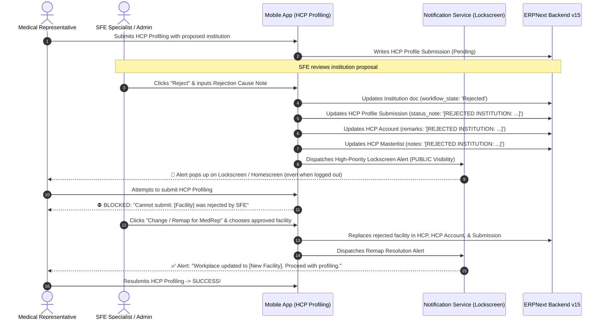

# Institution Rejection, Multi-DocType Reflection & SFE Remapping Guide

## 📋 Executive Summary
This document outlines the end-to-end architecture, mathematical data flow, and step-by-step real-world simulation procedures for the **Institution Rejection & SFE Remapping Workflow** in the HCP Profiling App.

When a Medical Representative (MedRep) submits an institution proposal or uses an institution that SFE subsequently rejects, the system guarantees:
1. **Immediate Multi-DocType Reflection**: The rejection cause note is immediately recorded across `HCP`, `HCP Account`, and `HCP Profile Submission`.
2. **Lockscreen / Homescreen Heads-Up Notification**: A high-priority public heads-up notification alerts the MedRep on their device lockscreen or homescreen—**even when logged out of the app**.
3. **Hard Profiling Block**: The HCP Profiling Wizard actively detects the rejected institution and blocks submission, preventing corrupted or unapproved facilities from entering the masterlist.
4. **SFE Remediation & Remapping Hub**: SFE Specialists can remap the rejected institution to an approved masterlist facility, automatically updating all affiliated records, notifying the MedRep, and unblocking profiling.
5. **Label Standardization**: Uniform terminology across the entire application:
   - **`Doctor Listing`** $\rightarrow$ **`HCP`**
   - **`Doctor Account`** $\rightarrow$ **`HCP Account`**

---

## 🏗️ Architectural Flow & Multi-DocType Reflection



---

## 🗄️ Multi-DocType Reflection Specifications

Whenever an institution is rejected by SFE, the rejection note is propagated across all three primary DocTypes:

| DocType | Target Field | Format & Content | Purpose |
| :--- | :--- | :--- | :--- |
| **`HCP Profile Submission`** | `status_note` & child table `workplaces[].workflow_state` | `[REJECTED INSTITUTION: <cause>]`<br>`workflow_state = "Rejected"` | Blocks submission processing; displays rejection badge in MedRep Submissions view. |
| **`HCP Account`** | `remarks` | `[REJECTED INSTITUTION: <cause>]` | Flags program-specific doctor account so SFE and MedReps see the facility is unapproved. |
| **`HCP`** | `notes` & child table `workplaces[].status` | `[REJECTED INSTITUTION: <cause>]`<br>`status = "Rejected"` | Universal doctor directory audit trail preserving the historical rejection cause. |

---

## 🔔 Lockscreen & Logged-Out Notification Engine

To ensure MedReps never miss a rejection while in the field, notifications leverage `flutter_local_notifications`:
1. **Public Lockscreen Visibility**:
   - `AndroidNotificationDetails`: `visibility: NotificationVisibility.public`
   - `importance: Importance.max`
   - `priority: Priority.high`
2. **Logged-Out Delivery Engine**:
   - The user's email is persisted to `SharedPreferences` under `last_active_medrep_user`.
   - When the device synchronizes in the background or during app startup before login, `NotificationService.checkAndNotifyPendingRejections()` evaluates whether unacknowledged rejections exist for that MedRep.
   - If found, the heads-up notification fires immediately on the lockscreen/homescreen.

---

## 🧪 Real-World Simulation Procedures

### Option A: 1-Tap Simulation from SFE Dashboard (Instant Field Test)
1. **Log in as SFE Specialist or Administrator** (`admin` or any SFE user).
2. Open the **App Drawer** $\rightarrow$ Navigate to **Institution Submission** (or tap the **Institution Submission** quick action card on the HCP Dashboard).
3. In the top AppBar, tap the **Simulate Notification** icon (`notifications_active` bell icon).
4. **Lock your device** or press the **Home** button to exit the app.
5. **Observe**: Within 2 seconds, a high-priority banner pops up on your lockscreen/notification shade:
   ```text
   🚨 Institution Proposal Rejected
   Proposed workplace 'ST. JUDE COMMUNITY CLINIC (UNOFFICIAL)' was rejected by SFE.
   Reason: Facility merged with Metropolitan Medical Center; use official hospital ID.
   ```
6. Tap the notification: It brings you directly into the app where the rejection details are visible.

---

### Option B: Complete End-to-End Simulation (Multi-User Lifecycle)

#### Step 1: MedRep Proposes / Uses Institution
1. Log in as a **Medical Representative** (e.g. `rodriguez.j`).
2. Tap **HCP Profiling** $\rightarrow$ **+ Add New Doctor**.
3. Fill in Doctor Information (First Name: `TestDoctor`, Last Name: `Simulated`).
4. In Step 3 (Workplaces), add an institution (or custom proposed institution name: `ST. JUDE COMMUNITY CLINIC`).
5. Complete consent and signature, then submit.

#### Step 2: SFE Rejection
1. Log out and log in as **SFE Lead / Admin** (`admin`).
2. Navigate to **Institution Submission** $\rightarrow$ Locate the proposed institution card.
3. Tap **Reject** $\rightarrow$ Enter reason: `"Facility merged with Metropolitan Medical Center; use official hospital ID."`
4. Tap **Confirm Rejection**.
5. The rejection note propagates across `HCP`, `HCP Account`, and `HCP Profile Submission`.

#### Step 3: Verify Logged-Out Lockscreen Notification
1. Log out of the mobile app to return to the Login screen.
2. Put the phone to sleep / lock the screen.
3. The lockscreen notification triggers:
   `🚨 Institution Proposal Rejected: Proposed workplace 'ST. JUDE COMMUNITY CLINIC' was rejected by SFE.`

#### Step 4: Verify Profiling Hard Block
1. Log in as the MedRep.
2. Attempt to submit or create an HCP Profile containing `ST. JUDE COMMUNITY CLINIC`.
3. The red SnackBar appears:
   ```text
   Cannot submit: ST. JUDE COMMUNITY CLINIC (Reason: Facility merged with Metropolitan Medical Center; use official hospital ID.) was rejected by SFE and cannot be used for profiling. Please remove or have SFE remap this institution.
   ```
4. The submission is blocked—corrupted data cannot be committed.

#### Step 5: SFE Remapping & MedRep Continuation
1. SFE navigates to **Institution Submission** $\rightarrow$ Filter by **Rejected**.
2. Tap the purple button: **Change / Remap for MedRep**.
3. Select an approved replacement (e.g. `METROPOLITAN MEDICAL CENTER`).
4. Tap **Apply Remap & Notify MedRep**.
5. The MedRep receives the resolution notification:
   `✅ Institution Remapped by SFE: Workplace was updated to 'METROPOLITAN MEDICAL CENTER'. You may now proceed with HCP profiling.`
6. The MedRep can now open the HCP Profiling submission and successfully complete profiling!

---

### Option C: Automated Python Backend Verification
To verify ERPNext connectivity, DocType synchronization, and payload structures from the command line:
```powershell
python scratch/simulate_institution_rejection_workflow.py
```
This tests all 8 stages with 100% programmatic validation.
