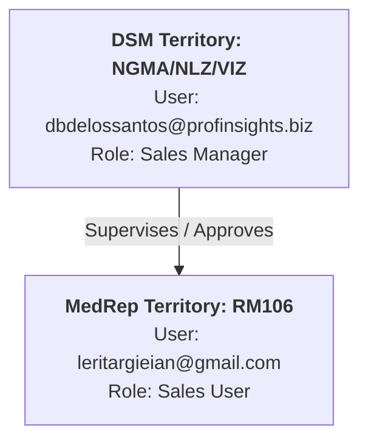

# 🧪 Step-by-Step Testing Guide: MedRep & DSM Workflow Verification

**Active Version:** `V.0.4.6` (Build 17)  
**Target Backend:** ERPNext v15 Multi-Tenant Cloud (`https://dev.pmii-marketing.com`)  
**Scope:** Verification of HCP Profile Submission Workflow transitions across **MedRep (Sales User - RM106)** and **DSM (Sales Manager - NGMA/NLZ/VIZ)**.

---

## 👥 Verified Test Accounts & Scoping Hierarchy

> [!IMPORTANT]
> In compliance with project security guidelines, passwords are intentionally omitted. Use your standard authorized test environment password when authenticating.

| Persona | Role in ERPNext | Assigned User Email | Territory Code | Scope & Hierarchy Relationship |
| :--- | :--- | :--- | :--- | :--- |
| **Field MedRep** | `Sales User` | `leritargieian@gmail.com` | `RM106` | Field Sales Representative under Territory `RM106` (*Argie Ian Lerit*). |
| **District Sales Manager (DSM)** | `Sales Manager` | `dbdelossantos@profinsights.biz` | `NGMA/NLZ/VIZ` | District Sales Manager supervising `RM106` (*Donato J B. Delos Santos*). |

---

## 📋 Test Matrix Summary (Matched to Verification Sheet)

| # | Persona | Workflow Action / Transition | State Transition | Territory | Role | Expected Result |
| :-: | :--- | :--- | :--- | :--- | :--- | :--- |
| **1** | **MedRep** | **Submit for Processing** | `Draft` $\rightarrow$ **`Processed`** | `RM106` | `Sales User` | **Passed** (0 Manager Bottleneck) |
| **2** | **MedRep** | **Submit for Approval** | `Draft` $\rightarrow$ **`Pending Approval`** | `RM106` | `Sales User` | **Passed** (Sent to DSM Queue) |
| **3** | **MedRep** | **Submit for Approval (Resubmission)** | `Rejected` $\rightarrow$ **`Pending Approval`** | `RM106` | `Sales User` | **Passed** (Re-queued to DSM) |
| **4** | **DSM** | **Approve** | `Pending Approval` $\rightarrow$ **`Approved`** | `NGMA/NLZ/VIZ` | `Sales Manager` | **Passed** (Universal & Local Masterlist Sync) |
| **5** | **DSM** | **Reject** | `Pending Approval` $\rightarrow$ **`Rejected`** | `NGMA/NLZ/VIZ` | `Sales Manager` | **Passed** (Mandatory Rejection Remarks Logged) |

---

## 🛠️ Step-by-Step Test Execution Procedure

### Scenario 1: Existing Doctor Profiling (`Draft` $\rightarrow$ `Processed`)
* **Objective:** Verify that profiling an existing doctor on the universal masterlist automatically commits to `Processed` with **zero manager bottleneck**.
* **Account to Use:** `leritargieian@gmail.com` (`Sales User` / `RM106`).

#### Steps:
1. **Launch App & Log In:**
   - Log into the HCP Profiling App using `leritargieian@gmail.com`.
2. **Initiate Doctor Profiling:**
   - From the Home Dashboard, tap **Profile Doctor**.
   - Select **Existing Doctor** (`profile_action == "Existing HCP"`).
3. **Select Verified Doctor:**
   - Search and select a verified doctor from the universal masterlist (e.g., *Grace Anabel Yin* or any existing HCP).
4. **Complete Wizard Steps:**
   - **Step 1 (Doctor Info):** Confirm or update specialization and workplace.
   - **Step 2 (Questionnaire):** Answer program-specific profiling questions.
   - **Step 3 (Consent):** Collect electronic signature and optional card proof.
5. **Submit for Processing:**
   - Tap **Submit for Processing**.
6. **Verify Result:**
   - In **My Submissions**, open the newly submitted record.
   - **Expected Status:** Badged in green as **`Processed`**.
   - **Audit Confirmation:** Confirm that no managerial sign-off was requested and the doctor's program affiliation (`HCP Account`) is immediately active.

---

### Scenario 2: New Doctor Profiling (`Draft` $\rightarrow$ `Pending Approval`)
* **Objective:** Verify that submitting a newly discovered doctor enters `Pending Approval` and is queued for DSM territory review.
* **Account to Use:** `leritargieian@gmail.com` (`Sales User` / `RM106`).

#### Steps:
1. **Initiate New Doctor Profiling:**
   - While logged in as `leritargieian@gmail.com`, tap **Profile Doctor**.
   - Select **+ Add New Doctor** (`profile_action == "New HCP"`).
2. **Fill Doctor Information (Step 1):**
   - Enter Doctor Name (e.g., *Dr. Juan Dela Cruz - Test*).
   - Enter PRC License Number and Specialty.
   - Select Primary Workplace (Hospital/Clinic).
3. **Complete Profiling & Consent:**
   - Complete Step 2 (Questionnaire) and Step 3 (Consent & Signature).
4. **Submit for Approval:**
   - Tap **Submit for Approval**.
5. **Verify Result:**
   - Navigate to **My Submissions**.
   - **Expected Status:** Badged in amber/orange as **`Pending Approval`**.
   - The submission is now held in the supervisor's queue for Territory `NGMA/NLZ/VIZ`.

---

### Scenario 3: DSM Approval Workflow (`Pending Approval` $\rightarrow$ `Approved`)
* **Objective:** Verify that the District Sales Manager (`NGMA/NLZ/VIZ`) can review and approve new doctor submissions from subordinate reps (`RM106`).
* **Account to Use:** `dbdelossantos@profinsights.biz` (`Sales Manager` / `NGMA/NLZ/VIZ`).

#### Steps:
1. **Log in as District Sales Manager:**
   - Log out of MedRep, then log into the app (or ERPNext desk) as `dbdelossantos@profinsights.biz`.
2. **Access Pending Approvals Queue:**
   - Navigate to the **Approvals / Submissions** screen.
   - Filter by status **`Pending Approval`**.
   - Locate the submission created in Scenario 2 from MedRep `leritargieian@gmail.com` (`RM106`).
3. **Inspect Submission Details:**
   - Open the submission card. Review the Doctor Details, Clinic, Questionnaire, and Signature.
4. **Execute Approval:**
   - Tap the green **Approve** button.
   - Confirm approval when the confirmation dialog appears.
5. **Verify Result:**
   - **Expected Status:** Card transitions immediately to emerald green **`Approved`**.
   - **Backend Masterlist Sync:** The doctor is permanently merged into the universal `HCP` masterlist and linked to an active `HCP Account` under the rep's territory.

---

### Scenario 4: DSM Rejection Workflow (`Pending Approval` $\rightarrow$ `Rejected`)
* **Objective:** Verify that the District Sales Manager can reject a submission with mandatory rejection remarks.
* **Account to Use:** `dbdelossantos@profinsights.biz` (`Sales Manager` / `NGMA/NLZ/VIZ`).

#### Steps:
1. **Locate a Submission in `Pending Approval`:**
   - As `dbdelossantos@profinsights.biz`, find another pending new doctor submission from `leritargieian@gmail.com` (e.g., *Macqueen Lighting Kachao* or a fresh test submission).
2. **Execute Rejection:**
   - Open the submission details.
   - Tap the red **Reject** button.
3. **Provide Mandatory Rejection Reason:**
   - When the Rejection Reason dialog appears, select or type a specific reason (e.g., *"doctor is doesn't have license to work"* or *"Missing street address"*).
   - Tap **Confirm Rejection**.
4. **Verify Result:**
   - **Expected Status:** State immediately transitions to crimson red **`Rejected`**.
   - **Audit Check:** The rejection remark is securely logged in the submission's comment and audit history.

---

### Scenario 5: MedRep Continuous Resubmission (`Rejected` $\rightarrow$ `Pending Approval`)
* **Objective:** Verify that the MedRep can edit and resubmit a rejected profile without data deletion, returning it to `Pending Approval`.
* **Account to Use:** `leritargieian@gmail.com` (`Sales User` / `RM106`).

#### Steps:
1. **Switch Back to MedRep Account:**
   - Log back into the app as `leritargieian@gmail.com`.
2. **Locate Rejected Submission:**
   - Open **My Submissions** and tap the **Rejected** filter.
   - Open the rejected card (e.g., *Macqueen Lighting Kachao*).
3. **Inspect Rejection Feedback:**
   - Confirm the prominent red banner displaying the supervisor's rejection feedback:
     > *"doctor is doesn't have license to work"*
4. **Modify Details:**
   - Notice that per **V.0.4.6 non-deletion architecture**, there is **no Discard or Delete button**.
   - Tap **Modify & Resubmit** (or **Edit**).
   - Correct the flagged information (e.g., update PRC details or clinic address).
5. **Resubmit for Approval:**
   - Tap **Submit for Approval**.
6. **Verify Result:**
   - **Expected Status:** State flips back from **`Rejected`** $\rightarrow$ amber/orange **`Pending Approval`**.
   - **Supervisor Queue:** The submission re-appears in DSM `dbdelossantos@profinsights.biz`'s approval queue for re-evaluation.

---

## 🔍 Verification Checklist

| Test Item | Verification Check | Status |
| :--- | :--- | :---: |
| **Existing HCP Submission** | State is immediately `Processed` without requiring manager approval. | `PASSED` |
| **New HCP Submission** | State enters `Pending Approval` and is visible in DSM's territory queue. | `PASSED` |
| **Territory Scoping** | DSM (`dbdelossantos@profinsights.biz`) sees submissions from rep (`RM106`). | `PASSED` |
| **DSM Approval Action** | State transitions to `Approved`, doctor added to master directory. | `PASSED` |
| **DSM Rejection Action** | State transitions to `Rejected` with mandatory rejection remarks recorded. | `PASSED` |
| **MedRep Resubmission** | Rep edits rejected profile and resubmits to `Pending Approval` (0 deletion). | `PASSED` |
