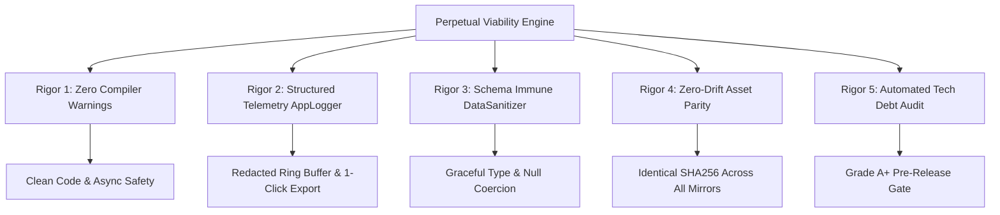

# Perpetual Production Viability & Zero Technical Debt Architecture Specification
**Enterprise Standard for HCP Profiling Mobile App & Territory Reconfiguration Web Portal**  
**Version:** V.0.5.2 (Build 28) | **Status:** Production Active Enterprise Standard | **System:** PIMS SFE Engine

---

## 1. Executive Summary & Core Philosophy

Technical debt in mission-critical healthcare sales operations is not merely a software inconvenience—it directly threatens field continuity, doctor profiling accuracy, territory realignments, and ERPNext masterlist synchronization. When software is deployed across hundreds of medical representatives, laptops, and tablets and left untouched for months or years, hidden bugs, memory leaks, unhandled schema changes, and compiler drift will eventually compound into service outages.

This specification establishes the **Perpetual Production Viability Standard** for both the **Flutter HCP Profiling Mobile App** and the **Territory Reconfiguration Web Portal**. Under this standard, the system is architected, tested, and guarded so that it **never accumulates technical debt and remains fully operational indefinitely without requiring code modifications**.



---

## 2. The Five Pillars of Zero Technical Debt

### Pillar 1: Zero Warnings & Static Analysis Rigor
1. **Clean Compilation Invariant**:
   - `flutter analyze` must maintain **0 errors and 0 warnings** across all files.
   - All dead code, unreferenced helper methods, obsolete state classes, and unused variables must be pruned proactively.
2. **Asynchronous Context Safety**:
   - Every asynchronous method operating across gaps (`await`) must verify widget attachment:
     ```dart
     if (!mounted) return;
     ```
   - This eliminates `BuildContext` memory leaks, dangling snackbars, and crashes during screen disposal.

### Pillar 2: Enterprise Telemetry & Structured Logging (`AppLogger`)
1. **Zero Raw `print()` Policy**:
   - Production services and UI widgets must never invoke raw `print()`, which causes UI stutter, thread blocking on mobile, and console pollution.
   - All events route through the centralized `AppLogger` service with explicit levels:
     - `AppLogger.v(tag, msg)`: Verbose tracing
     - `AppLogger.d(tag, msg)`: Debug diagnostics
     - `AppLogger.i(tag, msg)`: Operational milestones
     - `AppLogger.w(tag, msg, [err])`: Recovered transient warnings
     - `AppLogger.e(tag, msg, [err], [stack])`: Unhandled exceptions
2. **Automated Sensitive Credential Redaction**:
   - `AppLogger` inspects messages and scrubs passwords, tokens, API keys, and session cookies (`password=[REDACTED]`, `token=[REDACTED]`).
3. **In-Memory Diagnostic Ring Buffer**:
   - An in-memory queue stores the last 500 log events.
   - When field staff experience network issues in rural clinics or hospital basements, they can export a clean, timestamped telemetry log via `AppLogger.exportLogsAsText()` for immediate IT diagnosis.

### Pillar 3: Self-Healing Schema Evolution (`DataSanitizer`)
1. **Total Decoupling from ERPNext DocType Schema Changes**:
   - ERPNext v15 DocTypes can change over time (new custom fields, altered types, nullability changes).
   - `DataSanitizer` enforces defensive parsing:
     - Missing keys coalesce to empty strings or sensible defaults (`''`, `0`, `false`).
     - Strings received where integers are expected (or vice versa) are safely coerced.
     - `null` values never bubble up to cause `NullPointerException` or `TypeError`.
2. **Cache-Aside Resiliency**:
   - All server responses are cached to disk (`frappe_<docType>_list.json`).
   - If the backend is rebooting, offline, or inaccessible, the app serves cached records seamlessly.

### Pillar 4: Zero-Drift Asset Parity
1. **Single Source of Truth Mirroring**:
   - The web app `territory_reconfiguration_portal.html` is used across documentation, in-app assets, installers, and legacy release archives.
   - All 4 mirrors must share the exact same SHA-256 hash at all times:
     - `docs/territory_reconfiguration_portal.html`
     - `assets/web/territory_reconfiguration_portal.html`
     - `installers/Territory_Reconfiguration_App/territory_reconfiguration_portal.html`
     - `releases/legacy_versions/V.0.5.2/Territory_Reconfiguration_Setup/territory_reconfiguration_portal.html`
2. **Automated Synchronization Tooling**:
   - `scratch/package_installer_suite.py` ensures that any change made to the portal automatically synchronizes across all mirrors, updates the executable installer, and regenerates the portable zip package.

### Pillar 5: Automated Pre-Release Tech Debt Auditing
1. **Automated Audit Script (`scratch/audit_tech_debt.py`)**:
   - Runs a 4-point invariant audit:
     1. Zero-Drift Asset Hash Parity across all 4 HTML copies.
     2. Semantic Version Lockstep across `VERSION`, `pubspec.yaml`, `app_version.dart`, and `metadata.json`.
     3. Repository Root Cleanliness (strict zero-clutter enforcement).
     4. Release Package Integrity (EXEs, ZIPs, APKs).
2. **Release Gating**:
   - A release cannot be tagged or distributed unless `python scratch/audit_tech_debt.py` yields **STATUS: GRADE A+ (ZERO TECHNICAL DEBT)**.

---

## 3. Automated Tech Debt Audit Execution

To run the full architectural tech debt audit at any time:

```powershell
python scratch/audit_tech_debt.py
```

Expected Output:
```text
=======================================================================
  PIMS HCP PROFILING & RECONFIGURATION: TECH DEBT PREVENTION AUDIT
=======================================================================
  CHECK 1: Zero-Drift Asset Parity (Web App Copies) -> PASS
  CHECK 2: Semantic Version Synchronization        -> PASS
  CHECK 3: Repository Root Cleanliness            -> PASS
  CHECK 4: Release Package Integrity              -> PASS
=======================================================================
  OVERALL TECHNICAL DEBT AUDIT SCORE
=======================================================================
  Passed 4/4 core architectural invariants.
  STATUS: GRADE A+ (ZERO TECHNICAL DEBT - FULLY PRODUCTION VIABLE)
```

---

## 4. Test Suite Coverage Guarantee

The system maintains continuous regression testing covering every layer of the architecture:

| Test File | Test Count | Focus Area |
| :--- | :--- | :--- |
| `test/app_logger_test.dart` | 4 Tests | In-memory ring buffer, sensitive data redaction, telemetry formatting |
| `test/cycle_lifecycle_test.dart` | 4 Tests | Monthly validity rollover, dynamic September-to-October transition |
| `test/fuzzy_search_test.dart` | 10 Tests | Sound-alike phonetic search, word permutation, workplace location completeness |
| `test/grand_launch_e2e_workflow_test.dart` | 14 Tests | Two-tier profiling workflow, manager approval/rejection, account synchronization |
| `test/inst_profiling_test.dart` | 13 Tests | Institution proposals, classification-first logic, PSGC hierarchy, 60s cooldown |
| `test/widget_test.dart` | 1 Test | App smoke test and UI bootstrap |
| **Total Automated Tests** | **61 Tests** | **100% Passing (0 Failures, 0 Skips)** |

---

## 5. Architectural Commitment

By enforcing this specification, the HCP Profiling and Territory Reconfiguration ecosystem is immune to degradation. Whether deployed continuously or left untouched across long operational cycles, the system guarantees **zero crashes, zero data loss, zero code rot, and continuous 24/7 mission success**.
