# Territory Reconfiguration Web App & HCP Mobile App Direct Sync Simulation Guide

## 📋 Executive Summary
This document provides the end-to-end architecture, communication mechanics, and step-by-step simulation procedures for reconfiguring territories on the **Territory Reconfiguration Web App** and verifying direct synchronization in the **HCP Profiling Mobile App** (`V.0.6.2`).

The HCP profiling ecosystem supports two high-precision synchronization paths:
1. **The Live ERPNext Enterprise Pipeline**: Both the Web Portal and the Mobile App interface directly with ERPNext v15 (`https://dev.pmii-marketing.com`) DocTypes (`Territory`, `Sales Person`, `HCP Account`, `Employee`, `User`). Any reconfiguration staged and saved in the web app writes to ERPNext and immediately reflects across the mobile app.
2. **The Embedded Local Server Pipeline (`TerritoryWebServer`)**: The mobile app runs a self-hosted HTTP server on port `8765` with token authentication (`X-Portal-Token`). This serves the web portal directly to device browsers (Chrome / Safari) or laptop browsers over Wi-Fi, allowing field managers to reconfigure territories and sync live data without requiring external server setup.

---

## 🏗️ Architectural Synchronization Flow

```mermaid
sequenceDiagram
    autonumber
    actor SFE as SFE Lead / Administrator
    participant Web as Territory Reconfiguration Portal
    participant Server as Embedded Web Server (Port 8765)
    participant ERP as ERPNext Backend v15
    participant App as HCP Profiling Mobile App (V.0.6.2)
    actor MedRep as Medical Representative / DSM

    rect rgb(20, 30, 50)
    Note over SFE, App: Path A: Embedded Mobile-Hosted Server Sync
    SFE->>App: Opens App Drawer -> "Territory Reconfiguration"
    App->>Server: TerritoryWebServer.start() on Port 8765
    App->>Web: Opens in Device Chrome or Laptop Wi-Fi
    Web->>Server: GET /api/live-data?program=Abbott Diabetes Care
    Server-->>Web: Returns live masterlist JSON
    SFE->>Web: Modifies territory / assigns User ID / renames code
    Web->>Server: POST /api/sync (staged changes)
    Server-->>Web: Handshake 200 OK (Committed to memory/cache)
    end

    rect rgb(20, 45, 30)
    Note over SFE, App: Path B: Live ERPNext Enterprise Backend Sync
    SFE->>Web: Reconfigures Territory Manager / User ID / District Tree
    Web->>ERP: REST API: PUT /api/resource/Territory/<Code>
    ERP-->>Web: Updated (Docstatus 0/1, lft/rgt rebuilt)
    MedRep->>App: Logs in / switches program / Pull-to-refresh
    App->>ERP: GET /api/resource/Territory?fields=[...]
    ERP-->>App: Fresh Territory list with updated User ID & Managers
    App->>App: Caches to territory_infos_cache.json
    MedRep->>App: Opens HCP Wizard / Doctor Profiling
    App->>App: apiService.resolveUserTerritory() auto-detects reconfigured code
    App-->>MedRep: Territory Code & Manager pre-populated with new configuration!
    end
```



---

## 🧪 Simulation Scenarios & Step-by-Step Testing

### 📱 Simulation Option 1: 1-Device Embedded Mobile Handshake
*Use this option to test reconfiguration directly on your mobile device (Android / iOS) without needing a secondary computer.*

1. **Launch the Embedded Server from the Mobile App**:
   * Open the **HCP Profiling App** (`V.0.6.2`).
   * Log in as an Administrator or SFE Lead (e.g. `admin` or `lesantos@pims-marketing.com`).
   * Tap the **Menu Drawer** (top-left) $\rightarrow$ Select **Territory Reconfiguration**.
   * The `TerritoryPortalLauncherScreen` displays:
     * Status: **`Built-In Web Server Active (Port 8765)`** (green checkmark).
     * Device URL: `http://127.0.0.1:8765`.
2. **Open the Portal in Chrome/Safari**:
   * Tap the blue button: **`Open in Device Browser (Chrome / Safari)`**.
   * Chrome/Safari will open `http://127.0.0.1:8765`.
3. **Execute Reconfiguration in the Web Portal**:
   * Switch between **Territory Tree View** and **Table Grid View** (verify seamless switching).
   * In the Territory Tree or Grid, find territory **`AD0101`** (or `RM101`).
   * Click **Edit / Quick Reconfigure**:
     * Change **Assigned User ID** to your target test user (e.g., `lesantos@pims-marketing.com`).
     * Change **Assigned Sales Person** to your designated representative.
   * Click **Save Changes**.
4. **Verify Direct Reflection in the HCP Mobile App**:
   * Switch back to the **HCP Profiling Mobile App**.
   * Go to the **Dashboard** $\rightarrow$ Tap **+ Add New Doctor** (HCP Profiling Wizard).
   * Observe **Step 1 / Affiliation Details**:
     * The **Territory Code** automatically resolves to **`AD0101`**.
     * The **Territory Manager / Medrep** field automatically populates with the reconfigured manager!

---

### 💻 Simulation Option 2: 2-Device Laptop-to-Mobile Wi-Fi Pairing
*Use this option to simulate a field SFE Lead reconfiguring territories on a laptop while the Medical Representative holds the mobile device.*

1. **Connect Devices to the Same Wi-Fi or Mobile Hotspot**:
   * Connect both your laptop and mobile device to the same Wi-Fi network (or turn on Hotspot on the phone and connect the laptop).
2. **Retrieve Pairing Link from Mobile App**:
   * In the HCP App, navigate to **Territory Reconfiguration**.
   * Note the **Laptop Wi-Fi URL** shown on screen, which includes the ephemeral LAN security token:
     ```
     http://192.168.X.X:8765/?token=a8f09c7b...
     ```
   * *Alternative*: Point your laptop camera at the on-screen **QR Code** to open the link instantly.
3. **Reconfigure on Laptop Screen**:
   * On your laptop browser, the full-screen Territory Reconfiguration Suite loads with complete dark-blue high-precision aesthetics.
   * Perform any of the following commercial realignments:
     * **Realignment A (Reassign User ID)**: Assign an active territory to a different representative.
     * **Realignment B (Rename Territory Code)**: Right-click territory $\rightarrow$ Click **Rename** (e.g. `AD0101` $\rightarrow$ `ADC-T01`).
     * **Realignment C (Add Child Territory)**: Under district `AD1 - GMA/NORTH LUZON/CENTRAL LUZON`, click **+ Add Child Territory** $\rightarrow$ code `AD0199`.
   * Click **Submit / Stage Changes**.
4. **Observe Live Handshake in Mobile App**:
   * On the mobile device, pull down to refresh on the HCP list or reopen **Doctor Profiling**.
   * The new child territory (`AD0199`) and reassigned codes appear in dropdowns and submission forms immediately.

---

### 🌐 Simulation Option 3: Live Cloud Backend Synchronization (ERPNext v15)
*Use this option to verify enterprise synchronization through the live ERPNext database (`https://dev.pmii-marketing.com`).*

1. **Launch Desktop / Cloud Web Portal**:
   * Launch `releases/Territory_Reconfiguration_Setup.exe` (or open the deployed Streamlit Cloud instance).
   * Log in using authorized ERPNext credentials.
2. **Update Territory DocType**:
   * Select program: **Abbott Diabetes Care** (or **RiteMed** / **Bayer Consumer Health**).
   * Select a territory record (e.g., `AD0102` - assigned to `LIZA ROXAS`).
   * Reassign the territory manager to another active employee or update the `User ID`.
   * Save the territory. The web portal issues `PUT /api/resource/Territory/AD0102` with updated manager/user fields.
3. **Verify in HCP Mobile App**:
   * Open the HCP Mobile App.
   * If logged in as the affected representative:
     * Tap **Profile / Settings** $\rightarrow$ note the reconfigured territory badge.
     * Open **Submissions** $\rightarrow$ newly submitted doctor profiles automatically tag the new territory code.
   * If logged in as District Sales Manager (DSM):
     * Navigate to **Submissions History**.
     * Filter by **District / Territory Isolation**.
     * The DSM's managed scope (`apiService.getManagedTerritoryCodes()`) reflects the updated tree hierarchy.

---

## 🔍 HCP Mobile App Verification Checklist

Use this checklist during your simulation to confirm 100% sync integrity across all touchpoints:

| Touchpoint | HCP App Location | Expected Behavior After Web App Reconfiguration |
| :--- | :--- | :--- |
| **1. Doctor Profiling Wizard** | **`+ Add New Doctor`** $\rightarrow$ Step 1 | `apiService.resolveUserTerritory()` dynamically pre-fills the reconfigured `Territory Code` and `Territory Manager`. |
| **2. Doctor Affiliation Account** | **HCP Account Screen** | Program account card displays the remapped territory code for all doctors affiliated with that territory. |
| **3. DSM Submission Filtering** | **Submissions History Screen** | Submissions submitted under the reconfigured territory code appear within the DSM's territory scope. |
| **4. In-App Embedded Server Status** | **Territory Reconfiguration Screen** | Status badge indicates active port `8765`, local loopback URL, and live Wi-Fi IP address. |
| **5. Live Data Diagnostics** | Mobile Browser $\rightarrow$ `/api/status` | JSON response confirms app version `V.0.6.2`, available programs, and online server state. |

---

## 🛡️ Offline Resilience & Failover Simulation

If you simulate when ERPNext or the local Wi-Fi connection is temporarily disconnected:
1. **Cache-Aside Guarantee**: The mobile app seamlessly serves previously synchronized territories from disk cache (`territory_infos_cache.json`).
2. **Defensive Fallback**: If no disk cache exists, the app falls back to `TerritoryLiveData` containing the zero-dummy masterlist.
3. **Zero Crash Invariant**: Neither the mobile app nor the web portal will crash, throw unhandled exceptions, or display blank screens during network drops.
